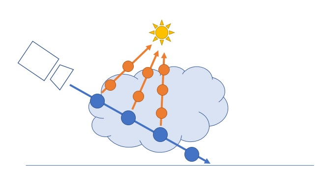
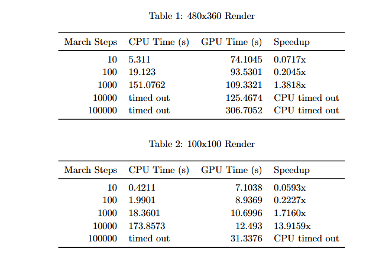
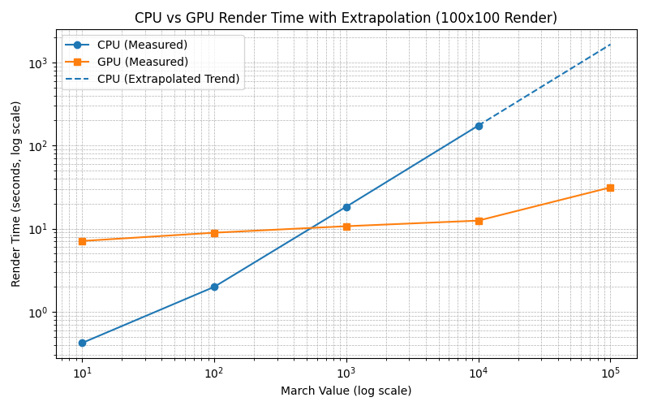
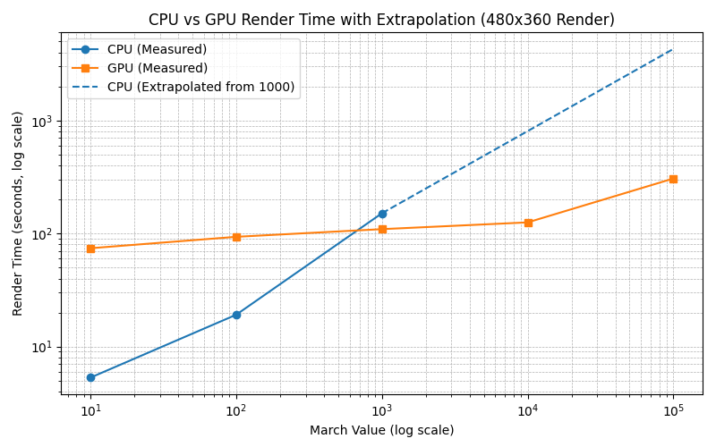
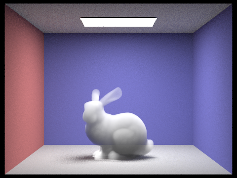
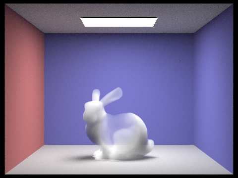



# Optimizing Ray-Marching using CUDA for Volumetric Rendering

## Introudction

Ray tracing is physically-based rendering technique used in computer graphics to generate realistic images by simulating the way light interacts with objects in a virtual scene. This method works by casting rays from the camera into the scene, and tracking how those rays interact with the objects within the scene itself. A particularly difficult interaction for this method of rendering to handle is interactions between light rays and participating media (materials that allow light to pass through them), and is known as volumetric rendering. Volumetric rendering is critical for rendering realistic clouds, fog, smoke, and other translucent materials. Traditional rendering techniques have difficult producing these effects because they are required to simulate transparency, absorption, and self-shadowing effects rather than a simple bounce off of a surface. This challenge is amplified when considering more complex participating media that have spatially varying densities, which prevent simple analytic visibility computations. The best algorithm to properly capture these fine visual details is known as ray marching, a numerical method that accurately resolves light transport by advancing rays iteratively through thousands of small steps at which the density field is sampled.

    
    
<em>Figure 1</em>. Diagram outlining how the ray marching algorithm works. The blue ray represents the primary ray that is being accumulated for the ray traced output, and the orange rays are shadow rays for self-shadowing effects as light marches along the blue primary ray. Courtesy of [1].

However, while computationally intensive, this ray marching algorithm is inherently parallel. Each step of the ray march involves relatively lightweight calculations, which allows for massive parallelism across GPU cores. In particular, the shadow rays, which are critical in properly modeling self-shadowing effects, can each be massively parallelized on the GPU and be computed in parallel.

To this end, our project aims to address these challenges by leveraging parallel computation, particularly GPU acceleration, to make volumetric rendering more efficient and practical for complex scenes.

## Approach

### Ray-Marching Algorithm

Volumetric ray marching on the GPU proceeds through four stages. In the first stage, we allocate device‐resident buffers for all intermediate data: a per-pixel color accumulation buffer, light source locations, and the volume parameters (\(\sigma_t\), \(\rho\)) defining the medium’s absorption coefficient and density.

In the primary ray march, each camera ray is sampled at uniform intervals \(\Delta s\), which is the distance of the primary ray's entry and exit point divided by the number of ray marches parameter. At each sample point \(\mathbf{x}_i\), we update the remaining transmittance  
\[
T \leftarrow T \,\exp\bigl(-\sigma_t\,\rho(\mathbf{x}_i)\,\Delta s\bigr)
\]  
and then spawn a shadow ray toward each light source to capture self-shadowing contributions.

Shadow rays are handled in the third stage by launching one CUDA thread per shadow ray all at once. Each thread first intersects the BVH to locate the exit point from the volume, then marches through the medium using the same attenuation rule as primary rays. Light contributions along each shadow path are stored in buffers.

In the final reduction stage, we perform a reduction over all thread-local buffers to combine shadow and primary results into the final per-pixel volumetric shading. To balance performance and quality, shadow rays typically use fewer march steps while primary rays employ finer sampling to mitigate aliasing.appropriate physics to push the object up.

### Bounding Volume Hierarchy (BVH)
One of the main issues that our ray marching algorithm faced was efficiently computing intersection points between all the rays, primary and shadow rays included, and the geometry of the participating medium in the scene. The models used in our simulation were meshes composed of 1,000s of triangles (often referred to as primitives) that defined the complex geometry of our scenes. Naively, this would mean that for every iterative samples, for every bounce of each ray, a linear search would need to be done across all the primitives in the scene. This obviously does not scale very well for scenes with highly detailed, high-poly models that can easily exceed 1,000,000 primitives. Consequently, we implemented a Bounding Volume Hierarchy (BVH), which can reduce our time complexity from $O(n)$ to $O(logn)$ across the primitives in the scene.

The BVH that we developed divides the scene into a tree hierarchy of axis-aligned bounding boxes. This tree was constructed by computing a tight bounding box around all the primitives in the scene, and then splitting along the centroid of the longest axis of the bounding box. We then recurse on the these splits until the number of primitives contained within a bounding box was sufficiently low (default $<4$ primitives). Now rather than having to compute an intersection between the ray and all the primitives in the scene, we compute the intersection between the ray and the bounding box, and keep traversing the tree, computing intersections between the ray and the bounding box of the appropriate child node until we reach a leaf where we compute the ray-triangle intersection of the primitives contained within that leaf node.

## Optimizations and Experimentation

### Test Environment
Our experiments were conducted on the Perlmutter supercomputer, specifically utilizing its GPU and CPU compute nodes to compare performance. For each run, only a single node was allocated to ensure consistency and to isolate the effects of hardware differences. The only node variable changed between tests was the -C flag, which toggled between the CPU and GPU nodes. The only runtime variable for our program which we changed between tests was the -G flag, which toggled between our CPU and GPU implementations. All other parameters were held constant to ensure a fair comparison. This controlled setup allowed us to directly attribute any observed performance differences to the underlying hardware and parallelization strategies rather than to differences in scene setup or algorithmic parameters.

### BVH on GPU

To make BVH traversal efficient on the GPU, we flattened the hierarchical tree structure into a contiguous linear buffer. This approach enables coalesced memory access and avoids the overhead of pointer chasing, which is inefficient on GPUs. Each node in the flattened buffer contains the bounding box information and indices to its children or contained primitives. Since GPUs do not support recursion efficiently, instead of implementing a recursive BVH traversal, we used an explicit stack managed in local memory within each thread. This iterative approach allows thousands of rays to traverse the BVH in parallel without incurring call stack overhead or risking stack overflows. The primitives themselves are also stored in a contiguous buffer, further improving memory access patterns and throughput.

### GPU Thread Per Shadow Ray

In our ray marching algorithm, each primary ray may generate multiple shadow rays at each step to account for self-shadowing effects. On the GPU, we assign a separate thread to each shadow ray, allowing these computations to proceed entirely in parallel. This design leverages the inherent independence of shadow ray calculations since each shadow ray samples the density field and accumulates transmittance independently of others. By mapping each shadow ray to a CUDA thread, we maximize occupancy and throughput, especially in scenes with many lights or complex volumetric effects. The results from all shadow rays are then accumulated in a reduction step to compute the final light contribution for each primary ray.

### Power Functions

We additionally benchmarked three approaches for computing the exponential attenuation of light in the medium:

1. powf: Fast single-precision power function
      
2. pow: Standard double-precision power function 

3. incremental multiplication:  Repeatedly multiplying the attenuation factor at each step.

For small numbers of march steps (i.e., 10-100), powf was the fastest, followed by incremental multiplications, with pow being the slowest. For larger numbers of march steps (i.e., 1000-100,000), powf remained the fastest, but pow overtook incremental multiplication in speed. This is likely because repeated multiplication becomes increasingly expensive as the number of steps grows, while the power functions maintain constant-time complexity regardless of the exponent size.

## Results

### CPU vs. GPU Performance Profile

    
    
<em>Figure 2</em>. Tables comparing performance on CPU vs. GPU.

The above tables show render times for both CPU and GPU implementations at various march step counts and resolutions. At low march step counts (i.e., 10 or 100), the CPU outperforms the GPU. This is expected, as the overhead of initializing GPU kernels and transferring data outweighs the benefits of parallelism for small workloads. For example, at 10 steps on a 480x260 render, the CPU completes in 5.3 seconds, while the GPU takes almost 14x as long.

As the number of march steps increases, the GPU begins to outperform the CPU significantly. At 1,000 steps, the GPU is about 1.4x faster than the CPU, and at 10,000 steps, the CPU cannot complete within our node allocation time while the GPU completes in 306 seconds. This trend is even more pronounced at lower resolutions, where the GPU achieves up to 14x speedup at 10,000 steps.

This inflection point occurs because the GPU's parallelism amortizes the fixed overhead as the computational workload increases, allowing it to process many more rays and shadow rays simultaneously. The figures below further display this trend.

    
    
<em>Figure 3</em>. This figure plots render time versus march step count for both CPU and GPU implementations for a 100x100 render. The CPU curve rises steeply and quickly becomes infeasible for high step counts, while the GPU curve rises much more slowly, demonstrating its scalability for large workloads.

    
    
<em>Figure 4</em>. This figure plots render time versus march step count for both CPU and GPU implementations for a 480x360 render. Similarly to that of the 100x100 render, the CPU curve rises steeply and quickly becomes infeasible for high step counts, while the GPU curve rises much more slowly, demonstrating its scalability for large workloads.

Both graphs exhibit a similar shape because they reflect the same underlying computational trends (just with a different render size): the GPU's fixed overhead is only overcome at larger workloads, after which parallelism yields dramatic speedups.

### Visual Parity

Visual parity between the CPU and GPU implementations' outputs is crucial for correctness. For a given march size and identical scene parameters, the output images from both implementations should be visually indistinguishable. This ensures that the parallelization and GPU-specific optimizations do not introduce artifacts or errors. In our experiments, side-by-side comparisons of renders (i.e., 100 march steps, 10 shadow march steps) confirmed that both CPU and GPU outputs were identical, validating the correctness of our GPU implementation.

    
    
<em>Figure 5</em>. CPU render

    
    
<em>Figure 6</em>. GPU render.

## Limitations and Future Work

### Serial Sections and Amdahl's Law

Despite extensive parallelization, some parts of the rendering pipeline remain serial, such as scene setup, BVH construction, and final image compositing. Furthermore, each primary ray's shadow rays depend on its current position along the march path. While shadow rays for a single position can be parallelized, they cannot be computed until the primary ray reaches the corresponding position, creating a temporal serialization where shadow ray batches have to wait for primary ray progress. According to Amdahl's Law, the speedup from parallelization is fundamentally limited by the fraction of the code that must execute serially. As a result, even with infinite GPU resources, the overall speedup would be capped by these serial bottlenecks. Further work could focus on parallelizing or pipelining these sections to push the speedup ceiling even higher.

### Further Kernel Optimizations

Additional GPU kernel optimizations could include:

1. Improving memory coalescing and reducing divergent branches within kernels
2. Using shared memory for frequently accessed data
3. Employing warp-level primitives (e.g. reductions, prefix sums, etc.)
4. Mergin kernels to minimize global memory acesses and reduce kernel launch overhead.

Implementing these optimizations could improve our GPU utilization, bringing our implementation closer to the theoretical peak.

### Further Parallelization

Currently, only ray marching and shadow ray computations are fully parallelized on the GPU. Further speedup could be achieved by parallelizing the entire rendering pipeline at the per-pixel level, assigning each pixel (or even each sample within a pixel) to a separate GPU thread. This would enable full-scene rendering in a single pass, maximizing GPU occupancy and minimizing synchronization overhead.

### Custom Density Functions

Expanding the variety of density functions allows for more realistic and diverse volumetric effects. The current system supports any density function, however, future work could implement physically-inspired density phenomena like smoke, clouds, fire, and fog. These could be parameterized to mimic real-world measurements or artist-driven controls, and could leverage domain warping, layering, or noise-based blending for added realism.

    
    
<em>Figure 7</em>. Custom density function that cuts out a sphere. Non-uniform density exemplifies the need to sample hundreds or thousands of times to prevent aliasing, something our GPU-accelerated implementation handles seamlessly.

### Better Pipelining

Improved pipelining would allow the system to overlap computation and data transfer, reducing idle times while waiting for GPU results. For example, while one batch of rays is being processed by the GPU, the CPU could prepare the next batch or handle post-processing tasks. Asynchronous kernel launches and memory transfers, combined with double-buffering, could further minimize latency and maximize hardware utilization.

## Conclusion

In this project, we implemented and parallelized volumetric rendering from scratch to demonstrate that leveraging GPU parallelism for volumetric ray marching yields substantial performance improvements over CPU-based implementations, especially as the computational workload increases. Our experiments showed that while CPUs can outperform GPUs at low march step counts due to lower overhead, GPUs quickly surpass CPUs as the number of steps grows, achieving speedups of over an order of magnitude for complex scenes and high resolutions. This scalability is a direct result of mapping the inherently parallel tasks of ray and shadow computation onto GPU threads, enabling efficient processing of the massive data and computation demands of realistic volumetric rendering.

We additionally ensured visual parity between CPU and GPU outputs, confirming the correctness of our parallel implementation. However, our analysis highlighted that certain serial components of the pipeline, such as scene setup, BVH construction, and final image compositing, remain bottlenecks that limit overall speedup according to Amdahl's Law. Addressing these serial sections, along with further GPU kernel optimizations and broader parallelization of the rendering pipeline, are promising avenues for future growth of our project.

Overall, our results validate the effectiveness of GPU acceleration for physically-based volumetric rendering and lay the groundwork for further enhancements in both performance and realism for complex scenes involving participating media like clouds, fog, and smoke.

## References

[1] C. Wallis. Volumetric Rendering Part 2. https://wallisc.github.io/rendering/2020/05/02/Volumetric-Rendering-Part-2.html, 2020.

[2] Scratchapixel. Volume Rendering - Introduction to Volume Rendering. https://www.scratchapixel.com/lessons/3d-basic-rendering/volume-rendering-for-developers/intro-volume-rendering.html

[3] CS 184/284A: Computer Graphics and Imaging, Spring 2025. Homework 3: Path Tracer 2. University of California, Berkeley. https://cs184.eecs.berkeley.edu/sp25/hw/hw3/
